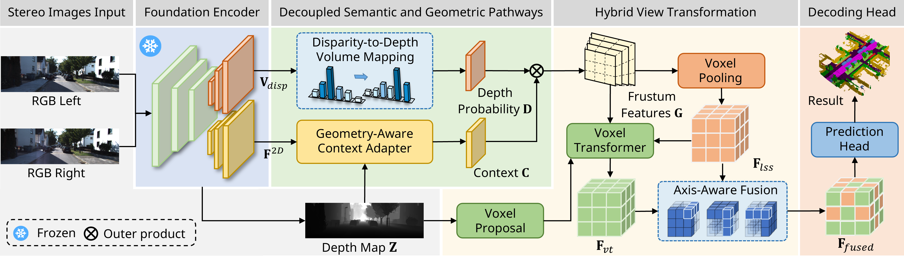
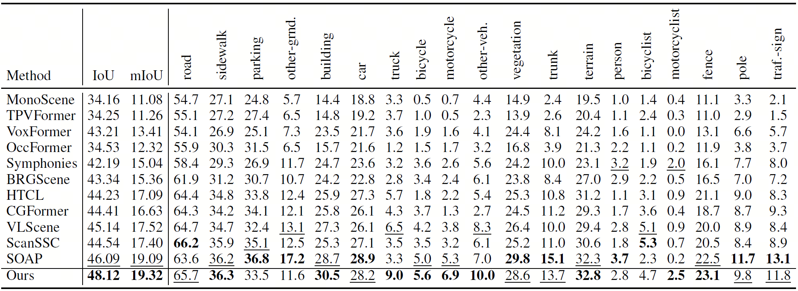
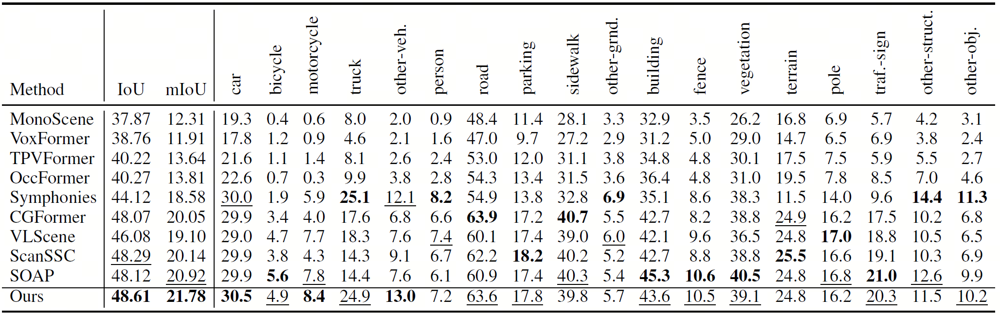

# [AAAI 2026] Unleashing Semantic and Geometric Priors for 3D Scene Completion

## 🚀 News

- **2026.01.21** code released
- **2025.11.08** Accepted by AAAI 2026
- **2025.08.19** [**arXiv**](https://arxiv.org/abs/2508.13601) preprint released

## Introduction

Camera-based 3D semantic scene completion (SSC) provides dense geometric and semantic perception for autonomous driving and robotic navigation. However, existing methods rely on a coupled encoder to deliver both semantic and geometric priors, which forces the model to make a trade-off between conflicting demands and limits its overall performance. To tackle these challenges, we propose FoundationSSC, a novel framework that performs dual decoupling at both the source and pathway levels. At the source level, we introduce a foundation encoder that provides rich semantic feature priors for the semantic branch and high-fidelity stereo cost volumes for the geometric branch. At the pathway level, these priors are refined through specialised, decoupled pathways, yielding superior semantic context and depth distributions. Our dual-decoupling design produces disentangled and refined inputs, which are then utilised by a hybrid view transformation to generate complementary 3D features. Additionally, we introduce a novel Axis-Aware Fusion (AAF) module that addresses the often-overlooked challenge of fusing these features by anisotropically merging them into a unified representation. Extensive experiments demonstrate the advantages of FoundationSSC, achieving simultaneous improvements in both semantic and geometric metrics, surpassing prior bests by +0.23 mIoU and +2.03 IoU on SemanticKITTI. Additionally, we achieve state-of-the-art performance on SSCBench-KITTI-360, with 21.78 mIoU and 48.61 IoU.

## Method



Overview of our proposed FoundationSSC framework. It begins with a Foundation Encoder producing decoupled priors, which are then enhanced in Decoupled Semantic Geometric Pathways. A Hybrid View Transformation subsequently lifts and fuses these priors into a unified 3D volume, which is processed by a Decoding Head to yield the final prediction.

## Quantitative Results
Semantic Scene Completion results on SemanticKITTI test set:


Semantic Scene Completion results on SSCBench-KITTI-360 test set:


## Getting Started

step 1. Refer to [install.md](./docs/install.md) to install the environment.

step 2. Refer to [dataset.md](./docs/dataset.md) to prepare SemanticKITTI and SSCBench-KITTI-360 dataset.

step 3. Refer to [train_and_eval.md](./docs/train_and_eval.md) for training and evaluation.

step 4. Refer to [visualize.md](./docs/visualization.md) for visualization.

## Model Zoo

We provide the pretrained weights on SemanticKITTI and SSCBench-KITTI-360 datasets, reproduced with the released codebase.


|                           Dataset                            |    Encoder    |        IoU         |        mIoU        |                        Model Weights                         |
| :----------------------------------------------------------: | :------------: | :----------------: | :----------------: | :----------------------------------------------------------: |
| [SemanticKITTI](configs/FoundationSSC-SemanticKITTI.py) | FoundationStereo-L | 48.12, 47.91 (val) | 19.32, 20.36 (val) | [Link](https://drive.google.com/file/d/1tjDgo4tzlUsMF78zqApBlT7vaX03vO7x/view?usp=drive_link) |
| [SemanticKITTI](configs/FoundationSSC-small-SemanticKITTI.py) | FoundationStereo-S | 48.52, 47.53 (val) | 18.05, 18.19 (val) | [Link](https://drive.google.com/file/d/1y-xKUGWA2H4jFbpHJPyLvDq2wzuUAUmE/view?usp=drive_link) |
| [SSCBench-KITTI-360](configs/FoundationSSC-KITTI360.py) | FoundationStereo-L | 48.61 | 21.78 | [Link](https://drive.google.com/file/d/1521okBGCcyENZ4r29sxCpMWZOn3-Z-ZI/view?usp=drive_link) |
| [SSCBench-KITTI-360](configs/FoundationSSC-small-KITTI360.py) | FoundationStereo-S | 48.25 | 20.50 | [Link](https://drive.google.com/file/d/1AhddQy1aeuOi39isR8AlfwTbbNMkjf7z/view?usp=drive_link) |


## Acknowledgement

This project is developed based on the following open-sourced projects: [CGFormer](https://github.com/pkqbajng/CGFormer), [FoundationStereo](https://github.com/NVlabs/FoundationStereo), [DFormerv2](https://github.com/VCIP-RGBD/DFormer). Thanks for their excellent work.

## Bibtex

If you find our work beneficial for your research, please consider citing our paper and give us a star:

```
@inproceedings{FoundationSSC,
  title={Unleashing Semantic and Geometric Priors for 3D Scene Completion},
  author={Chen, Shiyuan and Sui, Wei and Zhang, Bohao and Boukhers, Zeyd and See, John and Yang, Cong},
  booktitle={Proceedings of the AAAI Conference on Artificial Intelligence},
  year={2026}
}
```
